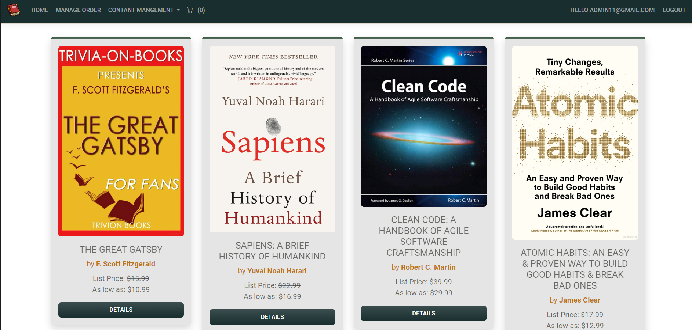
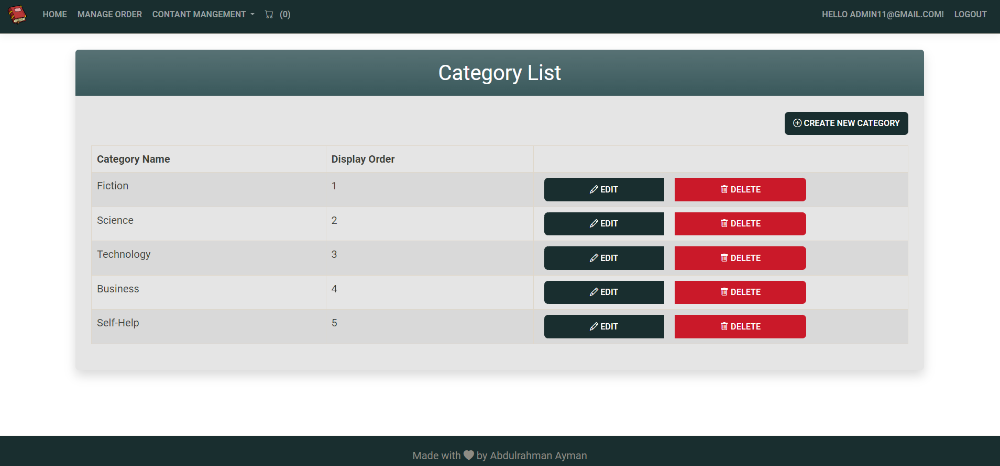
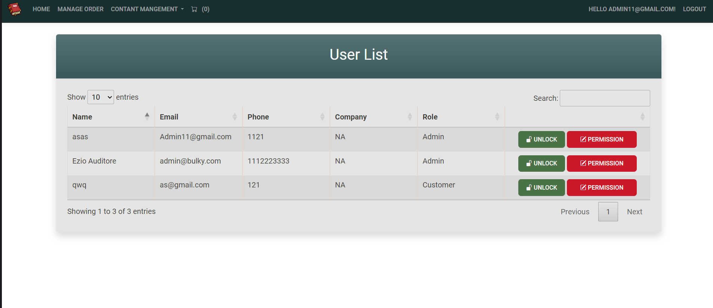
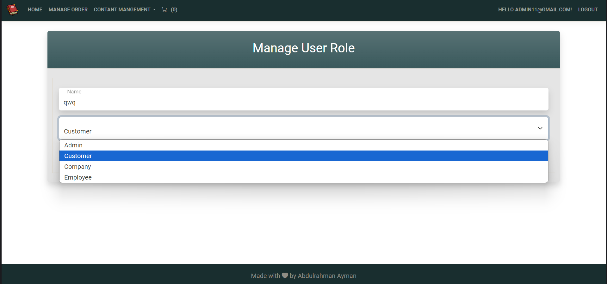
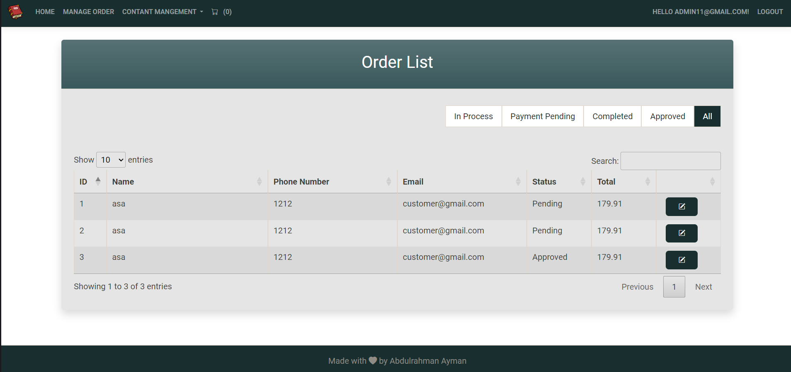
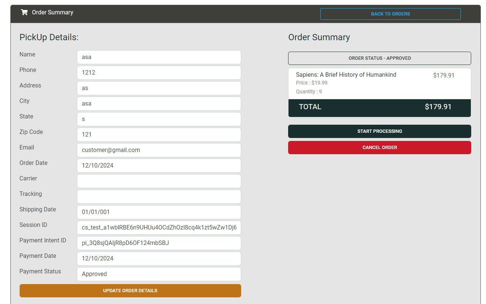
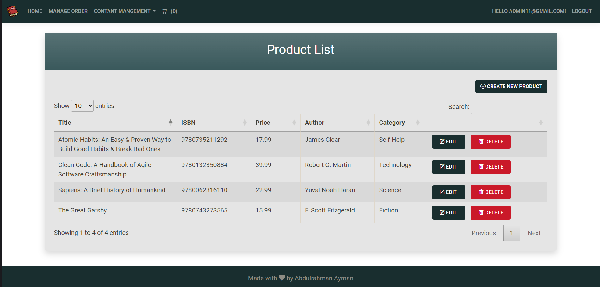

# BulkyBook MVC App

## Description

The **BulkyBook MVC App** is a feature-rich web application designed for managing book sales online. This project utilizes the MVC architecture of ASP.NET Core, providing a robust and scalable solution for e-commerce functionality. With integrated payment processing through Stripe and authentication options via Google, Facebook, and Microsoft, users can seamlessly navigate through a catalog of books, manage their accounts, and complete transactions securely.

The application implements various design patterns, including Repository and Unit of Work, ensuring clean architecture and separation of concerns. The use of Dependency Injection enhances the app's testability and flexibility. The responsive front-end design leverages Bootstrap, ensuring a user-friendly experience across devices.

### Features

- **User Authentication**: Supports login via Google, Facebook, and Microsoft accounts.
- **Payment Processing**: Integrates Stripe for secure payment transactions.
- **Responsive Design**: Built with HTML, CSS, JavaScript, and Bootstrap for a seamless user experience on various devices.
- **N-Tier Architecture**: Separates the application into layers for better organization and scalability.
- **Repository and Unit of Work Patterns**: Ensures efficient data access and management.

## Technologies Used

### Front-End
- **HTML**
- **CSS**
- **JavaScript**
- **Bootstrap**

### Back-End
- **C#**
- **ASP.NET Core (8)**
- **MVC Pattern**
- **MS SQL Server**

### Design Patterns
- **Repository Pattern**
- **Unit of Work Pattern**
- **Dependency Injection**
- **Identity for user authentication**

### Architecture
- **N-Tier Architecture**

### Usage
- **Register an account** to explore the features of the application.
- **Log in** using your credentials or through social logins.
- **Browse books**, add them to your cart, and proceed to checkout using Stripe for payments.

### Admin Login Credentials
To log in as an admin, use the following credentials:
- **Email**: `admin@bulky.com`
- **Password**: `Admin123!`

### Screenshots
## Admin Screens

### Admin Home

### Category List

### Manage Users

### Order Management

### Product List

